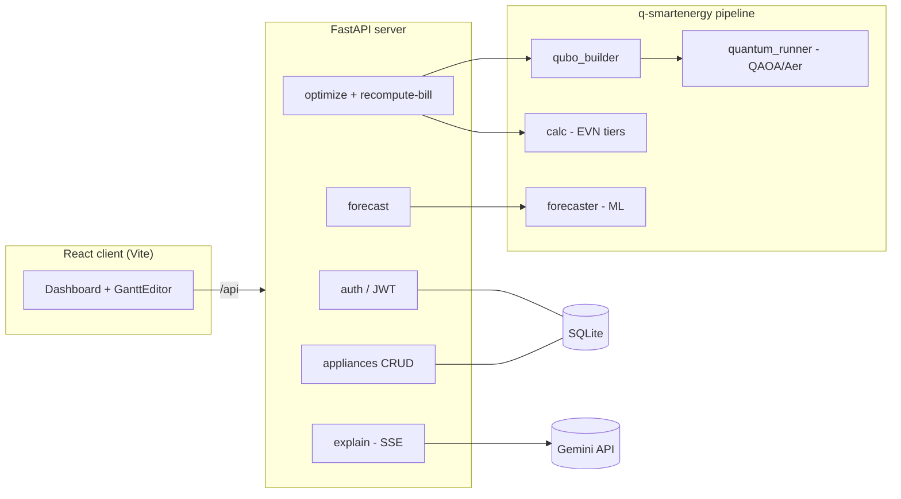

# Q-SmartEnergy

Quantum-optimized home appliance scheduling for Vietnamese households. A QAOA
(Quantum Approximate Optimization Algorithm) solver balances Vietnam's tiered
EVN electricity pricing against rooftop-solar self-consumption to find when each
flexible appliance should run to minimize the monthly bill — wrapped in a
FastAPI backend and a React dashboard with drag-and-drop schedule editing and a
Gemini-powered natural-language explanation of the result.

## Architecture



**Request flow:** the browser talks to the backend at `/api` (proxied by nginx
to the `api` container in Docker, or `http://localhost:8000` in local dev). The
optimizer builds a QUBO from the user's appliances + solar/tariff profiles,
solves it with QAOA on the Qiskit Aer simulator (classical brute-force fallback
for small qubit counts), then prices the resulting load profile through the real
EVN tiered tariff in `calc.py`. The `explain` endpoint streams a plain-language
summary from Gemini via Server-Sent Events.

## Components

| Path | What it is |
|------|------------|
| [`q-smartenergy/`](q-smartenergy/) | Quantum + classical optimization pipeline (QUBO, QAOA, EVN pricing, ML duration forecaster). See [its README](q-smartenergy/README.md). |
| [`server/`](server/) | FastAPI backend: JWT auth, appliance CRUD, `/optimize`, `/recompute-bill`, `/forecast`, `/explain` (SSE). SQLAlchemy + SQLite. |
| [`client/`](client/) | React + Vite dashboard: appliance editor, drag-and-drop Gantt scheduler, bill comparison, Gemini explanation. |

## Quick Start (Docker)

Requires Docker + Docker Compose.

```bash
cp .env.example .env        # then edit .env: set a 32+ char JWT_SECRET and
                            # (optionally) your GEMINI_API_KEY. The SQLite
                            # DATABASE_URL default already works as-is.
docker compose up --build
```

- Frontend: http://localhost:3000
- API: http://localhost:8000 (also reachable same-origin at `/api` via the frontend)

The database is SQLite, stored on the `api_data` Docker volume — no separate
database container, no password, nothing to wait for on startup. Docker Compose
reads the single `.env` automatically, both for `${...}` substitution in
`docker-compose.yml` and as the `api` container's environment. `.env` is
gitignored; never commit real secrets.

## Local Development

**Backend** (from `server/` — SQLite needs no external database):

```bash
pip install -r requirements.txt -r ../q-smartenergy/requirements.txt
# server/.env holds JWT_SECRET (32+ chars) and GEMINI_API_KEY; DATABASE_URL
# defaults to a local SQLite file (sqlite:///./q_smartenergy.db).
uvicorn main:app --reload --port 8000
```

**Frontend** (from `client/`):

```bash
npm install
npm run dev        # http://localhost:5173, proxying API to http://localhost:8000
```

## Tests

```bash
cd server && pytest -q                # backend + integration (needs JWT_SECRET set)
cd q-smartenergy && pytest tests/     # optimization pipeline
cd client && npm run build            # frontend build check
```

## Notes

- **Pricing model:** EVN cumulative/lũy tiến (staircase) tiers — the marginal
  price depends only on total monthly kWh, never on hour of day. There is no
  time-of-use / peak-hour component.
- **Security:** `JWT_SECRET` and `GEMINI_API_KEY` come from environment only
  (never hard-coded); passwords are bcrypt-hashed. The app refuses to start with
  a placeholder or short `JWT_SECRET`.
- **Palette:** Indigo `#3730A3`, Teal `#0F766E`, Gold `#CA8A04`.
