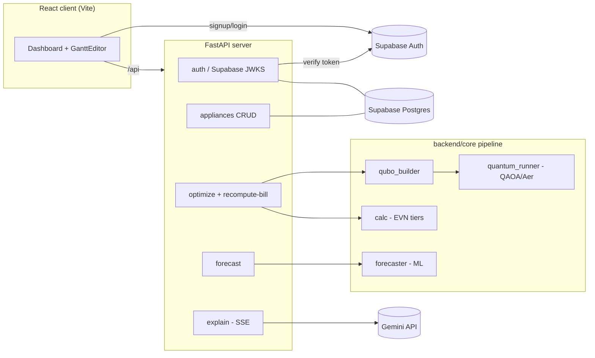

# Q-SmartEnergy

Quantum-optimized home appliance scheduling for Vietnamese households. A QAOA
(Quantum Approximate Optimization Algorithm) solver balances Vietnam's tiered
EVN electricity pricing against rooftop-solar self-consumption to find when each
flexible appliance should run to minimize the monthly bill — wrapped in a
FastAPI backend and a React dashboard with drag-and-drop schedule editing and a
Gemini-powered natural-language explanation of the result.

## Architecture



**Auth flow:** signup/login happen in the browser via **Supabase Auth** (email +
password). The frontend attaches the Supabase access token to every API call; the
backend verifies it against Supabase's public keys (JWKS) and maps it to a local
user row (created on first request, seeded with default appliances).

**Request flow:** the browser talks to the backend at `/api` (proxied by nginx
to the `api` container in Docker, or `http://localhost:8000` in local dev). The
optimizer builds a QUBO from the user's appliances + solar/tariff profiles,
solves it with QAOA on the Qiskit Aer simulator (classical brute-force fallback
for small qubit counts), then prices the resulting load profile through the real
EVN tiered tariff in `calc.py`. The `explain` endpoint streams a plain-language
summary from Gemini via Server-Sent Events.

## Components

| Path | What it is |
|------|------------|
| [`backend/`](backend/) | FastAPI backend + Quantum optimization pipeline (QAOA, EVN pricing, ML). Supabase Auth token verification, appliance CRUD, `/optimize`, `/recompute-bill`, `/forecast`, `/explain` (SSE). SQLAlchemy + Supabase Postgres. |
| [`client/`](client/) | React + Vite dashboard: appliance editor, drag-and-drop Gantt scheduler, bill comparison, Gemini explanation. **This is the official user interface.** |

> **One unified API.** The backend incorporates both the FastAPI web layer (`backend/api/`)
> and the quantum optimization engine (`backend/core/`), simplifying dependencies and test runs.

## Quick Start (Docker)

Requires Docker + Docker Compose, plus a **Supabase project** (create one at
supabase.com). In the Supabase dashboard, under **Authentication → Providers →
Email**, turn **off "Confirm email"** so signups can log in immediately.

```bash
cp .env.example .env        # then edit .env: set DATABASE_URL (Supabase Postgres),
                            # SUPABASE_URL, VITE_SUPABASE_URL, VITE_SUPABASE_ANON_KEY,
                            # and (optionally) GEMINI_API_KEY.
cd backend && alembic upgrade head && cd ..   # create tables in Supabase (once)
docker compose up --build
```

- Frontend: http://localhost:3000
- API: http://localhost:8000 (also reachable same-origin at `/api` via the frontend)

The database is **Supabase Postgres**. Get the connection string from
Supabase → Project Settings → Database (Session pooler or Direct connection, port
5432 — not the transaction pooler on 6543). Docker Compose reads the single `.env`
automatically, both for `${...}` substitution in `docker-compose.yml` and as the
`api` container's environment. `.env` is gitignored; never commit real secrets.
(The old `api_data` SQLite volume is no longer used.)

## Local Development

**Backend** (from `backend/`):

```bash
pip install -r requirements.txt
# backend/.env holds DATABASE_URL (Supabase Postgres), SUPABASE_URL, and
# (optionally) GEMINI_API_KEY. Run migrations once against Supabase:
alembic upgrade head
uvicorn main:app --reload --port 8000
```

**Frontend** (from `client/`):

```bash
npm install
# create client/.env with VITE_SUPABASE_URL and VITE_SUPABASE_ANON_KEY
# (and VITE_API_BASE_URL=http://localhost:8000). See client/.env.example.
npm run dev        # http://localhost:5173, proxying API to http://localhost:8000
```

## Database Migrations (Alembic)

The schema is versioned with Alembic (`backend/db/alembic/`). The app does **not**
create tables on startup, so run migrations once against your Supabase database
before first use (and after any model change):

```bash
cd backend
alembic upgrade head                       # apply migrations to DATABASE_URL (Supabase)
alembic revision --autogenerate -m "msg"   # after changing backend/db/models.py
```

Alembic reads `DATABASE_URL` from the environment (same source as the app) and
targets `models.py`'s metadata, so generated migrations stay in sync with the
models. Use the Session pooler / Direct connection (port 5432) for migrations —
the transaction pooler (6543) does not support the DDL Alembic runs.

## Tests

```bash
cd backend && pytest -q               # backend + integration + optimization pipeline
cd client && npm run build            # frontend build check
```

## Quantum Optimization (QUBO) — the math, stated honestly

The scheduler maps appliance timing to a QUBO and solves it with QAOA (Qiskit
Aer simulator), with a classical brute-force fallback. This section states the
model precisely and is upfront about its one deliberate simplification — the
kind of thing a sharp reviewer will probe.

**Decision variables.** Each *flexible* appliance `i` has ≥2 candidate start
hours. A binary `x_{i,k} = 1` means "appliance `i` starts at its candidate hour
`k`". *Fixed* appliances (fridge, AC, …) are not decision variables — they
contribute fixed kWh to the load.

**Objective.**

```
H = H_cost + H_solar + λ1·H_onehot + λ2·H_power

H_cost   =  Σ_{i,k} x_{i,k} · E_i · P(h_{i,k})                     # pay the tier price for the energy
H_solar  = -Σ_{i,k} x_{i,k} · min(E_i, S(h_{i,k})) · P(h_{i,k})    # credit back solar-covered kWh
H_onehot =  Σ_i ( Σ_k x_{i,k} − 1 )²                              # each appliance runs exactly once
H_power  =  Σ_{(i,k): power_i + F(h) > P_max} x_{i,k}                              # one load + fixed background already over threshold
         +  Σ_{(i,k),(i',k'): i≠i', h=h', power_i+power_i'+F(h) > P_max} x_{i,k}·x_{i',k'}   # two flexible loads sharing an hour over threshold
```

where `E_i` = power·duration (kWh), `P(h)` = marginal EVN tier price at hour `h`,
`S(h)` = solar kWh at `h`, `F(h)` = fixed background load (W) already ON at hour
`h`, `P_max` = the power threshold. Per variable, `H_cost + H_solar = E_i·P −
min(E_i,S)·P = max(0, E_i − S)·P` — only the **non-solar** part of the load is
billed. **H_cost/H_solar price the whole run at its START hour** `h_{i,k}`: a
2-hour wash started at 11:00 is billed at `P(11:00)` for both hours, not
`P(11:00)+P(12:00)`. Safe for the household staircase tariff (`P(h)` is flat
across the day, set by the monthly cumulative total), and a start-hour
approximation for the business TOU tariff — the same start-hour resolution
`H_power` uses.
`λ1 = λ2 = 1e6` (≈100–1000× the cost terms **for demo/catalog-scale
appliances**): large enough that, at those appliance sizes, a constraint
violation is not "bought back" by a cheaper schedule, yet small enough to keep
the QAOA cost landscape trainable. This is **not guaranteed for arbitrary
inputs** — `power_w`/`quantity` carry no upper bound, so a large enough appliance
(e.g. 15 kW × qty 5 × 24 h ≈ 360 kWh → a single cost term ≳ 1e6) can rival λ and
let the "run exactly once" constraint be violated. The API guards this case by
returning HTTP 422 rather than emitting a wrong schedule.

The two value axes can pull apart: when solar at an hour is strong, the optimizer
may pick an hour with a *higher* marginal tier price because the solar credit
outweighs the tier difference. So the honest claim is **"balances tier-avoidance
against solar self-consumption,"** not "always avoids tier jumps."

**The one deliberate simplification (and why it's safe).** Real EVN pricing is
cumulative/staircase: the marginal price is a step function of the household's
*total* monthly kWh, so in principle every appliance's marginal price depends on
what all the others do. The QUBO **linearizes** this — each candidate hour
carries a *fixed* marginal price `P(h)` (from `data_prep.py`), decoupled from the
joint schedule; we do **not** encode the tier boundaries with auxiliary binary
variables.

- *Why:* encoding the exact staircase needs extra binaries to represent which
  tier the cumulative total lands in, coupling every appliance to every other and
  inflating the qubit count far past the 4–6 qubit, simulator-friendly scale the
  whole PoC is built around. The fixed-price model keeps the problem at NISQ
  scale while still capturing the real trade-off.
- *Why it's safe to present:* the savings figure shown to the user is **not** the
  linearized QUBO objective — it is the **exact tiered bill** from
  `calc.calculate_bill` applied to the optimized monthly grid kWh. The QUBO is
  the search heuristic; the reported result uses the true tariff.
- For the PoC catalog the before/after grid totals land in the same tier, so
  within-month tier movement is small and the linear marginal-price proxy tracks
  the exact cost closely.
- `quantum_runner.compare_qaoa_hyperparameters()` brute-forces the QUBO's global
  optimum, so we can demonstrate QAOA actually *reaches* it — the approximation
  lives in the model, not in the solve.

See [`backend/core/qubo_builder.py`](backend/core/qubo_builder.py) for the
implementation.

## Notes

- **Pricing model:** EVN cumulative/lũy tiến (staircase) tiers — the marginal
  price depends only on total monthly kWh, never on hour of day. There is no
  time-of-use / peak-hour component.
- **Security:** authentication is handled by **Supabase Auth** — passwords never
  touch this backend. The backend verifies Supabase access tokens against the
  project's public keys (JWKS); `SUPABASE_URL`, `DATABASE_URL`, and `GEMINI_API_KEY`
  come from environment only (never hard-coded). The app refuses to start without
  `SUPABASE_URL`.
- **Palette:** Indigo `#3730A3`, Teal `#0F766E`, Gold `#CA8A04`.
