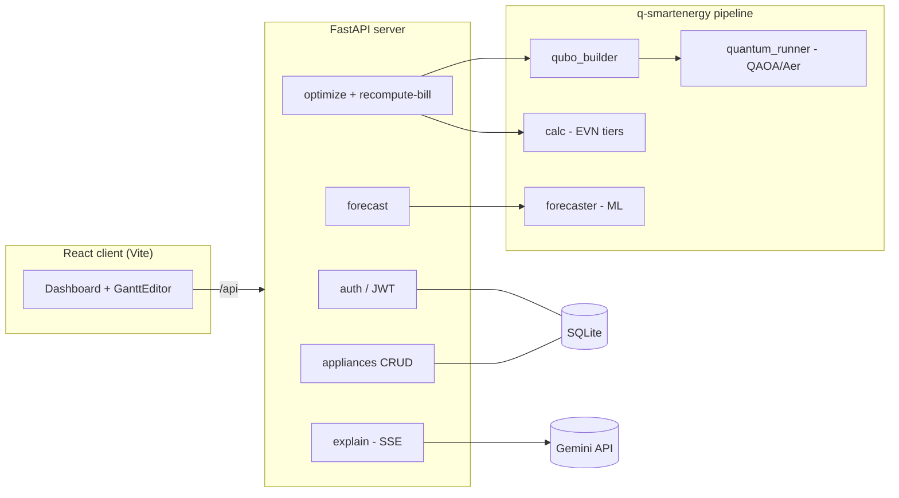

# Q-SmartEnergy

Quantum-optimized home appliance scheduling for Vietnamese households. A QAOA
(Quantum Approximate Optimization Algorithm) solver balances Vietnam's tiered
EVN electricity pricing against rooftop-solar self-consumption to find when each
flexible appliance should run to minimize the monthly bill — wrapped in a
FastAPI backend and a React dashboard with drag-and-drop schedule editing and a
Gemini-powered natural-language explanation of the result.

## Architecture



**Request flow:** the browser talks to the backend at `/api` (proxied by nginx
to the `api` container in Docker, or `http://localhost:8000` in local dev). The
optimizer builds a QUBO from the user's appliances + solar/tariff profiles,
solves it with QAOA on the Qiskit Aer simulator (classical brute-force fallback
for small qubit counts), then prices the resulting load profile through the real
EVN tiered tariff in `calc.py`. The `explain` endpoint streams a plain-language
summary from Gemini via Server-Sent Events.

## Components

| Path | What it is |
|------|------------|
| [`q-smartenergy/`](q-smartenergy/) | Quantum + classical optimization pipeline (QUBO, QAOA, EVN pricing, ML duration forecaster). See [its README](q-smartenergy/README.md). |
| [`server/`](server/) | FastAPI backend: JWT auth, appliance CRUD, `/optimize`, `/recompute-bill`, `/forecast`, `/explain` (SSE). SQLAlchemy + SQLite. |
| [`client/`](client/) | React + Vite dashboard: appliance editor, drag-and-drop Gantt scheduler, bill comparison, Gemini explanation. **This is the official user interface.** |

> **Two UIs, one product.** The **React client** (`client/`) is the official
> end-user interface, backed by the FastAPI server. The Streamlit app
> (`q-smartenergy/app.py`) is kept as a lightweight **debug/admin tool** for
> exercising the optimization pipeline directly (no auth, no database) — handy
> for development and demos of the quantum engine in isolation, not the product
> UI.

## Quick Start (Docker)

Requires Docker + Docker Compose.

```bash
cp .env.example .env        # then edit .env: set a 32+ char JWT_SECRET and
                            # (optionally) your GEMINI_API_KEY. The SQLite
                            # DATABASE_URL default already works as-is.
docker compose up --build
```

- Frontend: http://localhost:3000
- API: http://localhost:8000 (also reachable same-origin at `/api` via the frontend)

The database is SQLite, stored on the `api_data` Docker volume — no separate
database container, no password, nothing to wait for on startup. Docker Compose
reads the single `.env` automatically, both for `${...}` substitution in
`docker-compose.yml` and as the `api` container's environment. `.env` is
gitignored; never commit real secrets.

## Local Development

**Backend** (from `server/` — SQLite needs no external database):

```bash
pip install -r requirements.txt -r ../q-smartenergy/requirements.txt
# server/.env holds JWT_SECRET (32+ chars) and GEMINI_API_KEY; DATABASE_URL
# defaults to a local SQLite file (sqlite:///./q_smartenergy.db).
uvicorn main:app --reload --port 8000
```

**Frontend** (from `client/`):

```bash
npm install
npm run dev        # http://localhost:5173, proxying API to http://localhost:8000
```

## Database Migrations (Alembic)

The schema is versioned with Alembic (`server/alembic/`). For local dev and the
Docker demo the app calls `create_all` on startup, so the database just works
out of the box. For a managed deployment, run migrations as a deploy step:

```bash
cd server
alembic upgrade head                       # apply migrations to DATABASE_URL
alembic revision --autogenerate -m "msg"   # after changing server/models.py
```

Alembic reads `DATABASE_URL` from the environment (same source as the app) and
targets `models.py`'s metadata, so generated migrations stay in sync with the
models. To adopt an existing `create_all` database, run `alembic stamp head`
once before generating new revisions.

## Tests

```bash
cd server && pytest -q                # backend + integration (needs JWT_SECRET set)
cd q-smartenergy && pytest tests/     # optimization pipeline
cd client && npm run build            # frontend build check
```

## Quantum Optimization (QUBO) — the math, stated honestly

The scheduler maps appliance timing to a QUBO and solves it with QAOA (Qiskit
Aer simulator), with a classical brute-force fallback. This section states the
model precisely and is upfront about its one deliberate simplification — the
kind of thing a sharp reviewer will probe.

**Decision variables.** Each *flexible* appliance `i` has ≥2 candidate start
hours. A binary `x_{i,k} = 1` means "appliance `i` starts at its candidate hour
`k`". *Fixed* appliances (fridge, AC, …) are not decision variables — they
contribute fixed kWh to the load.

**Objective.**

```
H = H_cost + H_solar + λ1·H_onehot + λ2·H_power

H_cost   =  Σ_{i,k} x_{i,k} · E_i · P(h_{i,k})                     # pay the tier price for the energy
H_solar  = -Σ_{i,k} x_{i,k} · min(E_i, S(h_{i,k})) · P(h_{i,k})    # credit back solar-covered kWh
H_onehot =  Σ_i ( Σ_k x_{i,k} − 1 )²                              # each appliance runs exactly once
H_power  =  Σ over conflicting pairs  x_{i,k} · x_{i',k'}          # forbid simultaneous over-threshold draw
```

where `E_i` = power·duration (kWh), `P(h)` = marginal EVN tier price at hour `h`,
`S(h)` = solar kWh at `h`. Per variable, `H_cost + H_solar = E_i·P − min(E_i,S)·P
= max(0, E_i − S)·P` — only the **non-solar** part of the load is billed.
`λ1 = λ2 = 1e6` (≈100–1000× the cost terms): large enough that a constraint
violation can never be "bought back" by a cheaper schedule, yet small enough to
keep the QAOA cost landscape trainable.

The two value axes can pull apart: when solar at an hour is strong, the optimizer
may pick an hour with a *higher* marginal tier price because the solar credit
outweighs the tier difference. So the honest claim is **"balances tier-avoidance
against solar self-consumption,"** not "always avoids tier jumps."

**The one deliberate simplification (and why it's safe).** Real EVN pricing is
cumulative/staircase: the marginal price is a step function of the household's
*total* monthly kWh, so in principle every appliance's marginal price depends on
what all the others do. The QUBO **linearizes** this — each candidate hour
carries a *fixed* marginal price `P(h)` (from `data_prep.py`), decoupled from the
joint schedule; we do **not** encode the tier boundaries with auxiliary binary
variables.

- *Why:* encoding the exact staircase needs extra binaries to represent which
  tier the cumulative total lands in, coupling every appliance to every other and
  inflating the qubit count far past the 4–6 qubit, simulator-friendly scale the
  whole PoC is built around. The fixed-price model keeps the problem at NISQ
  scale while still capturing the real trade-off.
- *Why it's safe to present:* the savings figure shown to the user is **not** the
  linearized QUBO objective — it is the **exact tiered bill** from
  `calc.calculate_bill` applied to the optimized monthly grid kWh. The QUBO is
  the search heuristic; the reported result uses the true tariff.
- For the PoC catalog the before/after grid totals land in the same tier, so
  within-month tier movement is small and the linear marginal-price proxy tracks
  the exact cost closely.
- `quantum_runner.compare_qaoa_hyperparameters()` brute-forces the QUBO's global
  optimum, so we can demonstrate QAOA actually *reaches* it — the approximation
  lives in the model, not in the solve.

See [`q-smartenergy/qubo_builder.py`](q-smartenergy/qubo_builder.py) for the
implementation and [`q-smartenergy/README.md`](q-smartenergy/README.md) for the
economic framing.

## Notes

- **Pricing model:** EVN cumulative/lũy tiến (staircase) tiers — the marginal
  price depends only on total monthly kWh, never on hour of day. There is no
  time-of-use / peak-hour component.
- **Security:** `JWT_SECRET` and `GEMINI_API_KEY` come from environment only
  (never hard-coded); passwords are bcrypt-hashed. The app refuses to start with
  a placeholder or short `JWT_SECRET`.
- **Palette:** Indigo `#3730A3`, Teal `#0F766E`, Gold `#CA8A04`.
